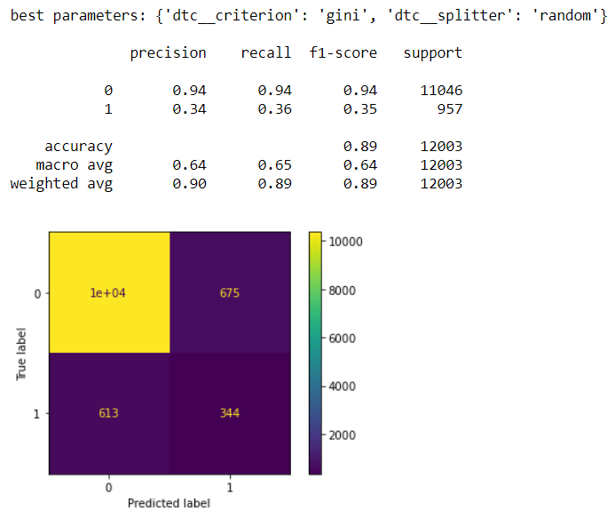

# Seattle Police - Terry Stops Analysis


## Overview

This project analyses Terry Stops recorded by officers of the Seattle Police Department and see which key features of a terry stop lead to an arrest.


## Problem at Hand

As positive public opinion increasingly shifts away from Police Departments across the nation. It is much more important now for departments to re-emphasis and adapts its focus to building Community relationships and improving internal accountability during these changing times. While the scope of the issue and myriad of solutions are large and profound. Terry Stops  is one area of focus that can begin to lay the groundwork for change. In order to address this issue, determining which key features of a terry stop leads to an arrest will be important to be able to create solutions that address terry stop arrests.


### Data

This project uses [public data](https://data.seattle.gov/Public-Safety/Terry-Stops/28ny-9ts8) from the Seattle Police Department and represents records of police reported stops under [Terry v. Ohio, 392 U.S. 1 (1968)](https://www.oyez.org/cases/1967/67). Each row represents a unique Terry Stop. Each record contains perceived demographics of the subject, as reported by the officer making the stop and officer demographics as reported to the Seattle Police Department, for employment purposes.


### Method

Various prediction models will be used in order to determine the key features that can predict which terry steps will lead to an arrest. 

The first step of the process is cleaning the data set being using. Column names were reformatted and NaN values were either converted to 'None' to align with the value already in the column or removed from columns that would be used for our modelling. Similar values such as 'None/Not Applicable" were also converted to 'None. The year and the month values were appended as new columns from the 'date reported' column. The type of columns were also converted. The 'officer_yob' column was transformed into the age and the arrest and frisk flags were converted into 1's and 0's. 

The second step of the process include prepping and the train test split of the data that we will be using modelling. After choosing the columns that will be used, we created our train test split and statified the target column. We then placed the categorical and continuous columns into separate variables. the target column was also stratified and smoted in order to address the class imbalance present.

The third step of the process include the use of different models to see which one would produce the best f1 score. We used the f1_score (precision and recall) because of our class imbalance and because it is a better indicator than the accuracy score with this analysis.

#### Baseline Model

a Dummy Classifier was used as the baseline model. The f1 score was 0.96 and 0.96. While these are great scores, there are inherent issues with the dummy classifer and using it beyond the train and test data.

Baseline Model Train Score & Confusion Matrix


Baseline Model Test Score & Confusion Matrix


Logistic Regression, KNearestNeighbor, DecisionTree, and Random Forest models were used to find an optimal f1 score. The best model was the random forest model and is further discussed in the results section.

#### Logistic Regression Model

The logistic regression model produced the same f1 scores in the train and test scores which is a good start. I want to see if I can improve on it with other models since the number of false positives in the confusion matrix is still high.


#### KNN Model


The KNN model produces a a train precision, recall, and f1 score on the train data set greater than the test data set which indicates that this model is overfitting. The number of false positives has decreased, but the number of false negatives has risen.

#### Decision Tree Model




The Decision Tree model produced better precision, recall, and f1 scores on the train set but not the test set. This tends to be the case because the model uses a greedy search approach. However since the train score is greater than the test score this does indicate that the model is overfitting. The false positives and false negatives are much lower than in the previous models.


### Results

The model that produced the best results for the analysis was the Random Forest Classifier model with the parameters of max depth at 5, minimum sample leaves at 3, and minimum sample split of 5. The model was able to get an f1 score of 0.84 on the train dataset and 0.83 on the test dataset. The most important features associated with this model include the year, officer age, and race. Our final model’s score was able to perform precisely and robustly 84% of the time.

#### Best Model Train Score & Confusion Matrix


#### Best Model Test Score & Confusion Matrix


## Recommendations

Three key features that the model highlighted as important in being able to predict if a terry stop would lead to an arrest are:

1 - Officer's and Subject's Race
2 - Time of the Year
3 - Officer's Age
 
While more research will need to be invested, a few preliminary solutions towards each recommednation include 1) trying to match an officer's race with the race of neighborhood they patrol whenever possible 2) coordinating a communication push during morning briefs on how police officers can manage or be aware of their own biases and 3) having training requirements for officer's who reach a certain age or time as an officer with an emphasis on diveristy and inclusiveness and community building skills.


### Future Analysis

Future analysis of a few key areas of the dataset would be beneficial to the model. The first area would be looking at the geographical data and seeing how the data breaks down by precint or sector. It would also be interesting to import latitude and longitude data of where the terry stop occured and see if there are any trends there. The second area would be the day of the week and time of day and seeing if the weekends or weekdays or a specific day or morning, afternoon, night could be anothe key feature. The third area would be to compare Seattle's performance to other cities of similar size and make up and see how they rank. 

Lastly, strategizing on how we can implement these changes into the department with stakeholder buy-in will be key in order to ensure these changes are interweaved into the structure of the police department.


### Repository Structure

```bash

├── Images                  
├── 01_data_cleaning.ipynb                  
├── 02_predictive_modelling.ipynb                   
├── 03_data_visualizations.ipynb                    
├── README.md                   
├── Terry_Stops.csv
└── Terry_stops_cleaned.csv

```